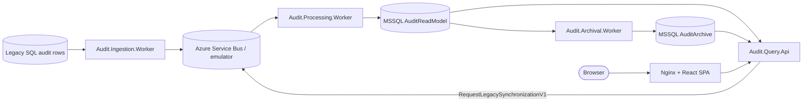

# Publink Audit

| Metadata | Value |
| --- | --- |
| Last updated | 2026-06-23 |
| Owner | Publink Audit engineering |
| Sources | `src/backend`, `src/frontend`, `docker`, `.github/workflows/ci.yml`, `docs/tasks/Zadanie.md` |
| Confidence | High for implemented system; Medium for business context from task brief |
| Related | [Glossary](docs/glossary.md), [System Overview](docs/architecture/system-overview.md), [REST API](docs/api/rest-api.md), [ADR index](docs/adr/README.md), [Solution Walkthrough](docs/presentation/solution-walkthrough.md) |

A treasurer received notice of a pending RIO (Regional Audit Office) inspection and needs to demonstrate who changed what and when on contracts and annexes. The legacy Contracts system stores audit rows but provides no purpose-built view. Publink Audit is a read-only explorer built on top of those rows: it ingests legacy SQL audit data, normalises it into canonical events, builds search and timeline projections, and exposes them through a React SPA and REST API. The treasurer can search by current or historical field values, inspect a chronological change timeline for any contract, and export a verifiable ZIP package to hand to auditors.

The codebase is the source of truth. Production details not represented in code or configuration are marked as: Assumption – requires validation.

## Business Purpose

Business capabilities implemented in code:

- Search active and archived contracts by current and historical values.
- Inspect contract audit timelines with actor, correlation ID, entity, change kind and field changes.
- Request manual synchronisation from the legacy source.
- Export timeline data as ZIP with `audit.csv`, `manifest.json` and `checksums.sha256`.
- Move inactive contracts from active read model to archive database.

## Business-Driven Decisions Beyond The Requirements

The task did not prescribe the following decisions. They were made to provide direct value to the treasurer and the business rather than solely to improve the technical design:

1. **Separate hot and cold storage.** Current audit data remains in fast, highly available storage, while older data is moved to a cheaper archive with a longer access time. The treasurer can work efficiently with the records most relevant to day-to-day operations, while the organisation retains historical data without paying the same storage cost for rarely accessed information.
2. **Export files with a manifest and checksums.** An export is a portable package that can be processed outside the application — during reporting, reconciliation, or an audit. The manifest describes the package contents and the SHA-256 checksums allow the recipient to verify whether any file has been changed or corrupted since it was generated.
3. **On-demand synchronisation with DLQ status visibility.** An operator can request synchronisation instead of waiting for the next scheduled cycle. The status view also reports events moved to the dead-letter queue (DLQ), so missing audit data is visible and can be investigated rather than silently creating an incomplete business picture.
4. **Search by historical values.** If a contract field changes over time (e.g. contractor name `ContractorA` → `ContractorB`), the contract is still findable by the historical alias in both active and archive views. This keeps search aligned with how auditors think about contract history rather than only the current projection state.

## What Was Consciously Skipped

The following are deliberate MVP trade-offs, not oversights:

- **Authentication and authorisation.** No identity provider integration, no tenant/object-level access control. The demo organisation ID is a deterministic context for local testing only. Production must add auth before any real data is served.
- **Legal evidence guarantees.** Exports have SHA-256 checksums but no WORM storage, cryptographic signatures or trusted timestamps. The system supports audit review, not formal legal evidence.
- **Production operations.** No CD pipeline, Kubernetes/Helm, Terraform/Bicep, registry publishing, production alerting or automated backup/recovery. Docker Compose covers local and demo use only.
- **Source-system write path.** The legacy system is read-only from this application. Any write-back, reconciliation or event-sourcing of the source is outside scope.

## Architecture In 10 Minutes



Backend deployables: `Audit.Query.Api` · `Audit.Ingestion.Worker` · `Audit.Processing.Worker` · `Audit.Archival.Worker`

Shared libraries: `Audit.Contracts` (messages) · `Audit.Domain` (entity/change codes) · `Audit.Application` (use cases, ports) · `Audit.Infrastructure` (EF Core, Dapper, MassTransit, adapters)

Frontend: `src/frontend` — React 19 + Vite + TanStack Query + i18next SPA served by Nginx.

Full detail: [Solution Walkthrough](docs/presentation/solution-walkthrough.md) · [ADR index](docs/adr/README.md) · [System Overview](docs/architecture/system-overview.md)

## Local Run

Copy the client connection template and set the legacy source connection string, then start the stack:

```powershell
Copy-Item docker/.env.client.example docker/.env.client
# edit docker/.env.client and set the legacy DB connection string
docker compose -f docker/docker-compose.yml up --build
```

Web UI: `http://localhost:3000` · Query API: `http://localhost:8080`

## Important Diagrams

| Diagram | Type | What it shows |
| --- | --- | --- |
| [C4 Context](docs/diagrams/c4/context.md) | C4 | System boundary — actors, external systems |
| [C4 Container](docs/diagrams/c4/container.md) | C4 | Runtime containers and their communication |
| [C4 Component](docs/diagrams/c4/component.md) | C4 | .NET project dependency graph |
| [Audit Data Flow](docs/diagrams/data-flow/audit-data-flow.md) | Data flow | End-to-end path from legacy SQL to query API |
| [Audit Storage ERD](docs/diagrams/erd/audit-storage.md) | ERD | Active and archive database schema |
| [Import & Processing Sequence](docs/diagrams/sequence/import-processing.md) | Sequence | Ingestion worker → Service Bus → Processing worker happy path and DLQ |
| [Archival Sequence](docs/diagrams/sequence/archival.md) | Sequence | Copy → Verify → Serializable recheck → Archive / Rollback |
| [Archival State Machine](docs/diagrams/state/archival-state.md) | State | `contract_archive_transfers` states including reactivation |
| [Query & Export Sequence](docs/diagrams/sequence/query-export.md) | Sequence | Search, timeline and ZIP export flows |
| [Manual Synchronisation Sequence](docs/diagrams/sequence/manual-synchronization.md) | Sequence | Operator-triggered sync request lifecycle |

## Navigation

- [Getting Started](docs/getting-started/local-development.md)
- [Architecture](docs/architecture/system-overview.md)
- [Domain](docs/domains/audit-domain.md)
- [API](docs/api/rest-api.md)
- [ADR index](docs/adr/README.md)
- [Solution Walkthrough](docs/presentation/solution-walkthrough.md)
- [Operations Runbook](docs/getting-started/runbook.md)
- [Application Flows Cheatsheet - PL](docs/presentation/application-flows-cheatsheet-pl.md)
- [Application Flows Cheatsheet - EN](docs/presentation/application-flows-cheatsheet-en.md)
