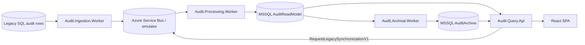

# Publink Audit Documentation

| Metadata | Value |
| --- | --- |
| Last updated | 2026-06-22 |
| Owner | Publink Audit engineering |
| Sources | `src/backend`, `src/frontend`, `docker`, `.github/workflows/ci.yml`, `docs/tasks/Zadanie.md` |
| Confidence | High for implemented system; Medium for business context from task brief |
| Related | [Glossary](glossary.md), [System Overview](architecture/system-overview.md), [REST API](api/rest-api.md), [Docker](infrastructure/docker.md), [ADR index](adr/README.md), [Solution Walkthrough](presentation/solution-walkthrough.md) |

Publink Audit is a contract audit-history MVP. It ingests legacy SQL audit rows, normalizes them into canonical audit messages, projects search and timeline read models, exposes read-only REST APIs, supports active/archive browsing in a React SPA and exports contract audit history as verifiable ZIP packages.

The codebase is the source of truth. Production details not represented in code or configuration are marked as: Assumption – requires validation.

## Business Purpose

The system helps audit operators answer who changed what, when, on which contract-related entity, and what values existed before and after the change. It supports audit review; it is not implemented as a qualified legal evidence system.

Business capabilities implemented in code:

- Search active and archived contracts by current and historical values.
- Inspect contract audit timelines with actor, correlation ID, entity, change kind and field changes.
- Request manual synchronization from the legacy source.
- Export timeline data as ZIP with `audit.csv`, `manifest.json` and `checksums.sha256`.
- Move inactive contracts from active read model to archive database.

## Accepted Architecture Snapshot

| Area | Accepted decision |
| --- | --- |
| Source integration | Configurable hourly SQL polling is a temporary workaround because the source application cannot emit events in this exercise. A controlled production source should publish native business events through its transactional outbox. |
| Backend | Four .NET 10 processes: ingestion, processing, archival, and query API, sharing application/domain contracts in one repository and release train. |
| Messaging | Azure Service Bus behind MassTransit adapters, at-least-once delivery, acknowledgment after database commit, bounded retry, and DLQ. MassTransit 8 is pinned for the sample; commercial use must revisit current licensing or use the native ASB SDK. |
| Idempotency | Unique `(Source, SourceEventId)` plus monotonic source sequences make duplicate and out-of-order deliveries safe for local effects. |
| Persistence | MSSQL is the owned store; EF Core handles writes/migrations/outbox, Dapper handles focused reads, and Persister/Reader ports replace a generic repository. PostgreSQL remains a viable greenfield alternative but adds no material value for this Microsoft/Azure-aligned exercise. |
| Data lifecycle | Complete contracts inactive for a configurable retention period move from hot MSSQL to a separate, cheaper/lower-availability archive database; no searchable header remains hot. Copy/verify/recheck/delete and reactivation are retryable workflows without distributed ACID. |
| UI/API | Polish and English active/archive views keep independent search, selection, and filter state. History appears only after selecting a contract. Both tiers support ZIP export with CSV, manifest, and SHA-256 checksums. |
| Operations | Manual synchronization is an ASB command, not a worker HTTP call. Status exposes checkpoint freshness and the `audit-projection` DLQ count; production additionally requires alerting and replay runbooks. |
| Security scope | Authentication and authorization are intentionally outside the MVP scope. The configured demo organization is only a deterministic tenant context and must not be treated as an identity or access-control boundary. |
| Evidence | Canonical events and rebuildable projections are not full event sourcing. Event sourcing, WORM, signatures, and trusted timestamps require a separate legal/operational decision. |

## Business-Driven Decisions Beyond The Requirements

The task did not prescribe the following decisions. They were made to provide direct
value to the treasurer and the business rather than solely to improve the technical
design:

1. **Separate hot and cold storage.** Current audit data remains in fast, highly
    available storage, while older data is moved to a cheaper archive with a longer
    access time. The treasurer can therefore work efficiently with the records most
    relevant to day-to-day operations, while the organization retains historical data
    without paying the same storage cost for information that is accessed rarely.
2. **Export files with a manifest and checksums.** An export is a portable package
    that can be processed later outside the application, for example during reporting,
    reconciliation, or an audit. The manifest describes the package contents and the
    SHA-256 checksums allow the recipient to verify whether any exported file has been
    changed or corrupted since it was generated.
3. **On-demand synchronization with DLQ status visibility.** An operator can request
    synchronization to bring the audit store up to date instead of waiting for the next
    scheduled cycle. The status view also reports events that could not be processed
    and were moved to the dead-letter queue (DLQ), so missing audit data is visible and
    can be investigated rather than silently creating an incomplete business picture.
4. **Search by historical values.** Search results stay useful when a contract field
    changes over time. If the contractor was first stored as `ContractorA`, later changed to `ContractorB`,
    the same contract can still be found by the historical alias value `ContractorA` in both active
    and archive views. This keeps search aligned with how auditors think about contract
    history rather than only the current projection state.

## Architecture In 10 Minutes



Backend deployables:

- `Audit.Query.Api`: REST API, health, Swagger, search, timeline, export and synchronization endpoints.
- `Audit.Ingestion.Worker`: scheduled legacy polling and manual synchronization command handling.
- `Audit.Processing.Worker`: consumes imported events and builds projections.
- `Audit.Archival.Worker`: archives inactive contracts to a separate archive store.

Shared libraries:

- `Audit.Contracts`: message contracts.
- `Audit.Domain`: change/entity codes and field-change logic.
- `Audit.Application`: use cases, policies and ports.
- `Audit.Infrastructure`: EF Core, Dapper, MassTransit, SQL adapters, archive snapshots and observability.

Extensibility guidance for new services and audited objects is documented in [System Overview](architecture/system-overview.md#extensibility-and-future-services).

Frontend:

- `src/frontend`: React 19 + Vite + TanStack Query + i18next SPA.

## Important Diagrams

| Diagram | What it shows / why it is useful |
| --- | --- |
| [Context](architecture/context-diagram.md) | System boundary: who uses Publink Audit and which external systems it depends on. Use it to explain that legacy SQL remains the source and Publink Audit is a read-side audit explorer. |
| [Container](architecture/container-diagram.md) | Runtime split between SPA, API, workers, Service Bus and MSSQL stores. Use it to understand deployables and why ingestion, processing, archival and reads fail independently. |
| [Component](architecture/component-diagram.md) | Backend project dependencies. Use it to see where contracts, domain logic, use cases and infrastructure adapters live. |
| [Backend Object Catalog](architecture/backend-object-catalog.md) | Backend objects, messages, services, entities, states and their role in the import/projection/query/archive process. Use it to understand what each backend object is responsible for. |
| [Deployment](architecture/deployment-diagram.md) | Implemented Docker Compose topology. Use it to map service names, ports and the shared MSSQL volume in local/demo runs. |
| [Data Flow](architecture/data-flow.md) | End-to-end audit data movement from legacy row to event, projections, API and archive. Use it to explain canonical event storage and read-model projection updates. |
| [Audit Storage ERD](diagrams/erd/audit-storage.md) | Active/archive database tables, canonical event storage, search projection tables, checkpoints, synchronization leases, archive transfers and MassTransit inbox/outbox tables. Use it to answer what is stored where. |
| [Archival State](diagrams/state/archival-state.md) | Archive lifecycle states and retryable transitions. Use it to explain copy/verify/recheck/delete behavior without distributed transactions. |
| [Import Sequence](diagrams/sequence/import-processing.md) | Import, processing retry and duplicate handling. Use it to explain at-least-once delivery and idempotent projection writes. |
| [Checkpoint And State Flow](diagrams/sequence/checkpoint-state-duplicates.md) | Checkpoints, API cursors, manual synchronization state, duplicate detection and archive transfer state in one operational view. Use it when debugging stale data, repeated messages or archive/reactivation progress. |

## Key Flows

1. Legacy import reads rows after checkpoint, maps rows to `AuditEntryImportedV1`, publishes messages and saves checkpoints.
2. Processing consumes audit events, ignores duplicates by `(Source, SourceEventId)`, appends canonical events to `audit_events` and updates query projections.
3. Query API reads active/archive SQL tables through Dapper and returns search/timeline/export responses.
4. Manual sync creates or joins a synchronization lease and sends `RequestLegacySynchronizationV1`.
5. Archival copies, verifies and rechecks contract data before deleting active rows.

Original imported audit events are stored in the active read model as canonical `audit_events` rows and copied into `archived_audit_events` during archival. Search does not query the legacy source directly: it uses the dedicated `contract_search` table plus `contract_search_aliases` for historical searchable values. MassTransit EF inbox/outbox support tables in the active database are `InboxStates`, `OutboxMessages` and `OutboxStates`; they are broker reliability tables, not business audit data.

## Local Run

```powershell
docker compose -f docker/docker-compose.yml up --build
```

Web UI: `http://localhost:3000`. Query API: `http://localhost:8080`.

## Configuration And Debugging

### Complete Docker Compose stack

Docker Compose reads `docker/.env` next to the compose file, while the ingestion service loads the client connection from `docker/.env.client`. The public demo values in `docker/.env` are for the local stack only.

Before the first start, copy the client connection template and set the read-only legacy source connection string:

```powershell
Copy-Item docker/.env.client.example docker/.env.client
```

Then start the full stack from the repository root:

```bash
docker compose -f docker/docker-compose.yml up --build
```

### Backend processes outside Docker

Each executable backend project has an `appsettings.Local.example.json`. Copy the relevant file to `appsettings.Local.json`, fill in the placeholders and run the project with `DOTNET_ENVIRONMENT=Local`.

### Debugging with Docker Compose

The repository includes Compose overrides for debugging one backend process locally while the rest of the stack runs in containers. The supported flow is: stop the stack, start the matching debug override, then launch the omitted process from Visual Studio or the shell.

### Frontend outside Docker

Copy `src/frontend/.env.example` to `src/frontend/.env.local`, set `VITE_API_PROXY_TARGET`, then run `npm run dev` from `src/frontend`.

### EF Core design-time operations

Design-time factories read `AUDIT_READ_MODEL_CONNECTION` or `AUDIT_ARCHIVE_CONNECTION` from the environment; they do not use the public Docker demo configuration.

## Deployment Summary

The implemented deployment is Docker Compose for local/demo use. CI validates backend, frontend and container builds. No CD pipeline, Kubernetes/Helm, Terraform/Bicep, registry publishing or production cloud topology exists in the repository.

## Navigation

- [Getting Started](getting-started/local-development.md)
- [Architecture](architecture/system-overview.md)
- [Backend Object Catalog](architecture/backend-object-catalog.md)
- [Extensibility And Future Services](architecture/system-overview.md#extensibility-and-future-services)
- [Domain](domains/audit-domain.md)
- [API](api/rest-api.md)
- [Infrastructure](infrastructure/deployment.md)
- [Operations Runbook](getting-started/runbook.md)
- [ADR index](adr/README.md)
- [Application Flows Cheatsheet - PL](presentation/application-flows-cheatsheet-pl.md)
- [Application Flows Cheatsheet - EN](presentation/application-flows-cheatsheet-en.md)
- [Solution Walkthrough](presentation/solution-walkthrough.md)
- [Documentation Gap Analysis](documentation-gap-analysis.md)