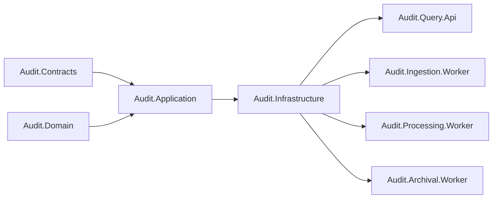

# Component Diagram

| Metadata | Value |
| --- | --- |
| Last updated | 2026-06-21 |
| Owner | Publink Audit architecture |
| Sources | Project references and code structure |
| Confidence | High |
| Related | [C4 Component](../diagrams/c4/component.md), [Dependencies](dependencies.md) |

This diagram explains code ownership rather than runtime traffic. Shared contracts/domain/application projects define the stable model and use cases, while `Audit.Infrastructure` implements SQL, broker, query, archive and observability adapters for application ports.