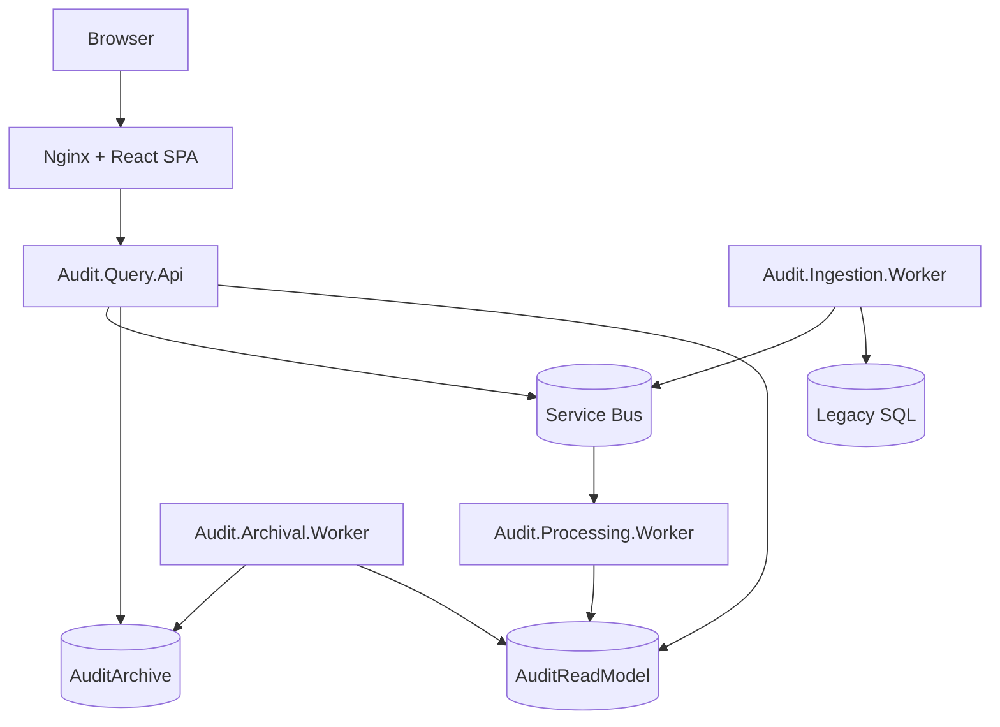

# Container Diagram

| Metadata | Value |
| --- | --- |
| Last updated | 2026-06-21 |
| Owner | Publink Audit architecture |
| Sources | Docker Compose, startup files |
| Confidence | High |
| Related | [C4 Container](../diagrams/c4/container.md), [Deployment](deployment-diagram.md) |

The diagram separates deployable responsibilities. Query API handles synchronous user-facing reads and exports, ingestion owns legacy polling and synchronization commands, processing builds the read model, and archival moves inactive contract data to the archive store.

Production container orchestration is not defined: Assumption – requires validation.