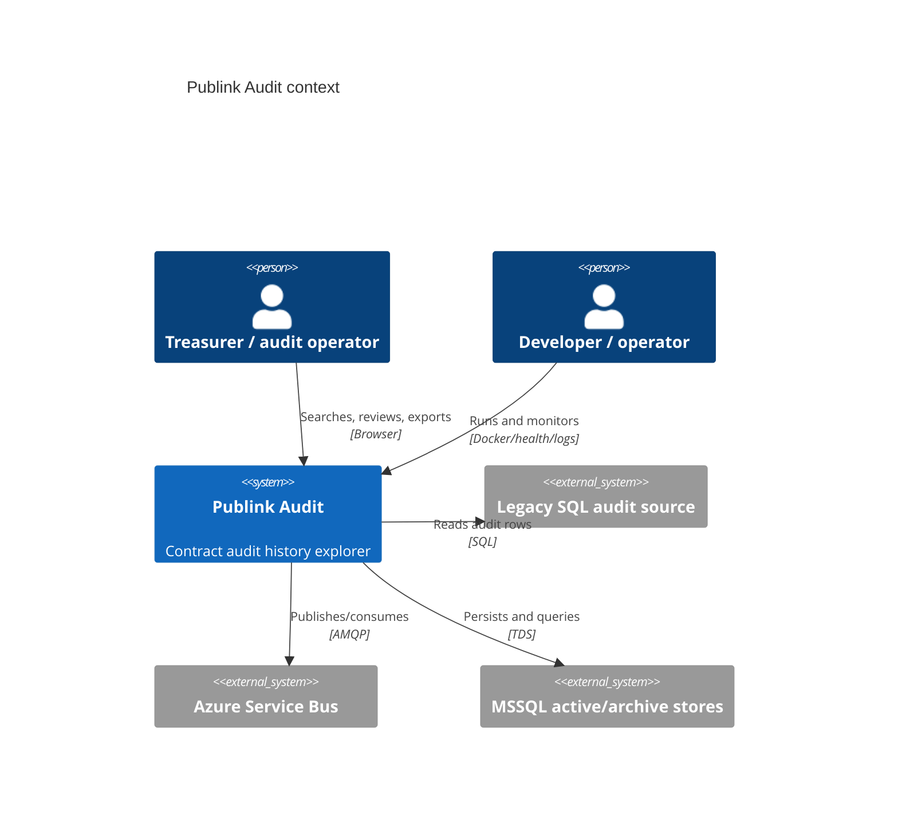

# Context Diagram

| Metadata | Value |
| --- | --- |
| Last updated | 2026-06-21 |
| Owner | Publink Audit architecture |
| Sources | Code/config analysis |
| Confidence | High |
| Related | [C4 Context](../diagrams/c4/context.md), [System Overview](system-overview.md) |

This diagram is the quickest way to read the system boundary. It shows that users interact only with Publink Audit, while the application integrates with legacy SQL for source audit rows, Service Bus for asynchronous work and MSSQL for its owned read/archive data.