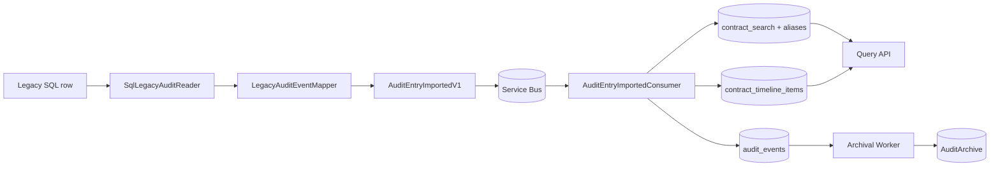

# Data Flow

| Metadata | Value |
| --- | --- |
| Last updated | 2026-06-21 |
| Owner | Publink Audit architecture |
| Sources | Legacy import, contracts, processing, queries, archive executor |
| Confidence | High |
| Related | [Audit Data Flow](../diagrams/data-flow/audit-data-flow.md), [Events](../api/events.md) |

Read the diagram left to right: legacy SQL rows are normalized into `AuditEntryImportedV1`, delivered through Service Bus, then persisted as canonical `audit_events` and projected into timeline/search tables. Query API reads those projections, while archival copies canonical events and projection snapshots into `AuditArchive` for inactive contracts.

Important storage detail: `audit_events` keeps the imported canonical event payload and source identifiers. It is the stored original audit message inside Publink Audit, but it is not full event sourcing; the query experience is served from derived projection tables.

Audit payloads can contain personal and contract data. Classification/retention policy is not defined: Assumption – requires validation.