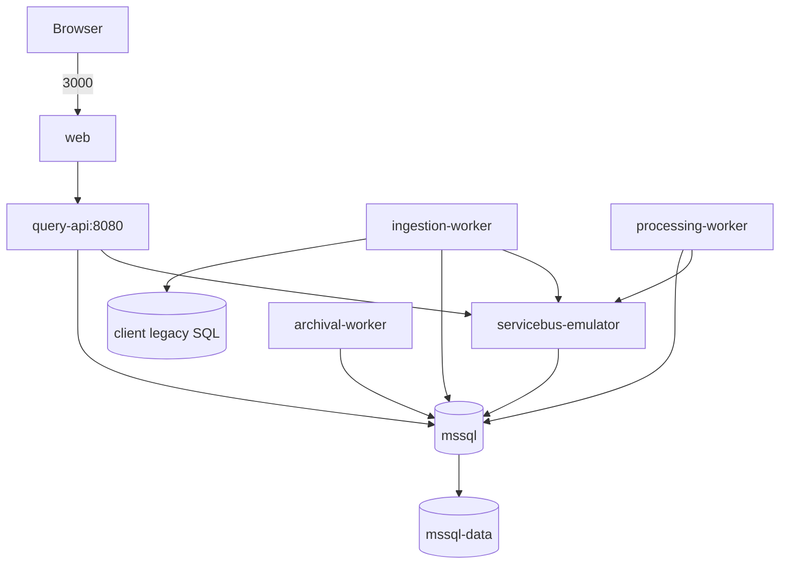

# Deployment Diagram

| Metadata | Value |
| --- | --- |
| Last updated | 2026-06-21 |
| Owner | Publink Audit DevOps |
| Sources | Docker Compose, Dockerfiles |
| Confidence | High for local/demo |
| Related | [Docker](../infrastructure/docker.md), [Deployment](../infrastructure/deployment.md) |

The diagram is the local/demo deployment map. It shows browser/API ports, Compose
service names, the external client legacy SQL dependency, and that only active,
archive, and MassTransit data share the local MSSQL container and persisted volume.

This is the implemented local/demo deployment. Production topology is: Assumption – requires validation.
