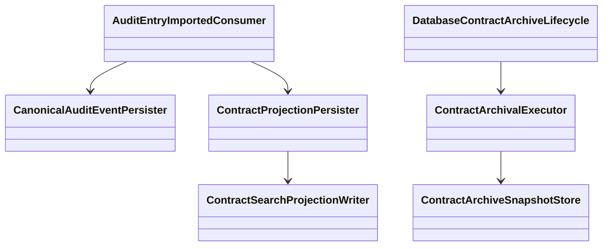

# Code Diagram

| Metadata | Value |
| --- | --- |
| Last updated | 2026-06-21 |
| Owner | Publink Audit engineering |
| Sources | Processing and archiving classes |
| Confidence | Medium; selective class-level view |
| Related | [Audit Domain](../../domains/audit-domain.md) |

