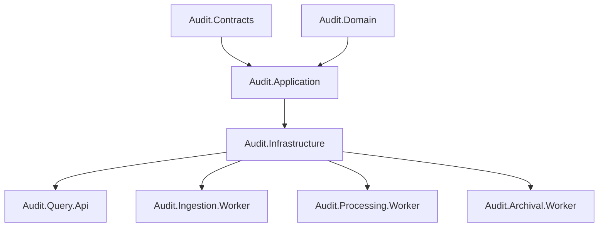

# C4 Component Diagram

| Metadata | Value |
| --- | --- |
| Last updated | 2026-06-23 |
| Owner | Publink Audit architecture |
| Sources | Backend projects |
| Confidence | High |
| Related | [Component Diagram](../../architecture/component-diagram.md) |

**Project responsibilities**

| Project | Primary responsibility |
| --- | --- |
| `Audit.Contracts` | Shared message contract types (`AuditEntryImportedV1`, `RequestLegacySynchronizationV1`, etc.) — no internal project dependencies. |
| `Audit.Domain` | Entity type codes, change kind codes, field-change value objects and domain logic — no internal project dependencies. |
| `Audit.Application` | Use cases, port interfaces (Persister, Reader) and business policies; depends on Contracts and Domain only. |
| `Audit.Infrastructure` | EF Core mappings, Dapper executors, MassTransit bus configuration, SQL adapters, archive snapshot logic and OpenTelemetry registration; depends on Application, Contracts and Domain. |
| `Audit.Query.Api` | ASP.NET Core host: REST endpoints, Swagger, health checks; depends on Application and Infrastructure. |
| `Audit.Ingestion.Worker` | .NET Worker host: legacy SQL polling loop, checkpoint management, manual-sync command handler; depends on Application, Contracts and Infrastructure. |
| `Audit.Processing.Worker` | .NET Worker host: MassTransit consumer for `AuditEntryImportedV1`, idempotency check, canonical event append and projection update; depends on Application, Contracts and Infrastructure. |
| `Audit.Archival.Worker` | .NET Worker host: periodic archival runner, copy/verify/recheck/delete lifecycle, reactivation path; depends on Application and Infrastructure. |

`Audit.Contracts` and `Audit.Domain` are shared-library leaves: they reference no other internal project. All other projects ultimately depend on them, which means message schemas and domain codes can change without circular dependencies.
