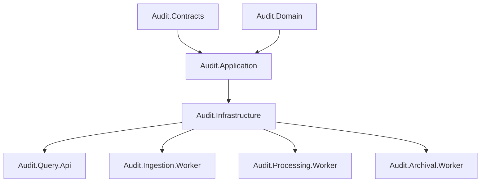

# C4 Component Diagram

| Metadata | Value |
| --- | --- |
| Last updated | 2026-06-21 |
| Owner | Publink Audit architecture |
| Sources | Backend projects |
| Confidence | High |
| Related | [Component Diagram](../../architecture/component-diagram.md) |

