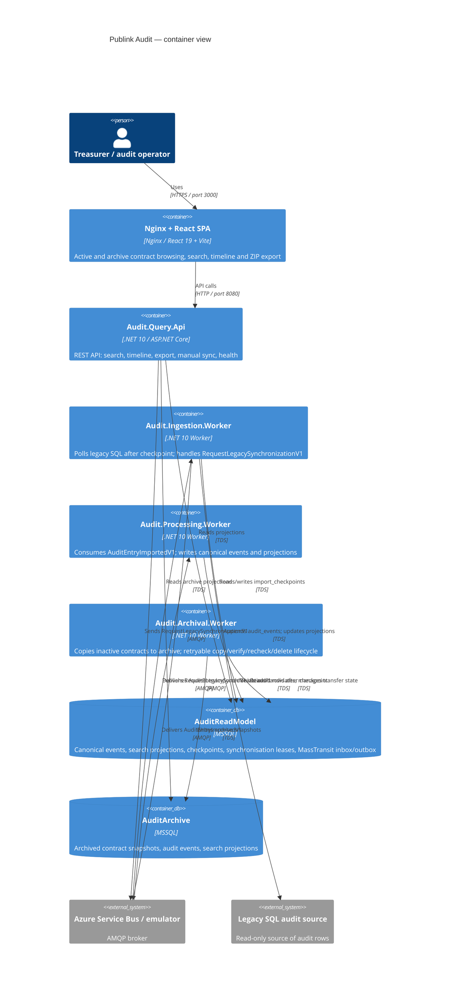

# C4 Container Diagram

| Metadata | Value |
| --- | --- |
| Last updated | 2026-06-23 |
| Owner | Publink Audit architecture |
| Sources | Docker Compose and startup files |
| Confidence | High |
| Related | [Container Diagram](../../architecture/container-diagram.md) |

**Why four backend processes instead of one monolith.** Each process has a distinct failure domain: a bug in archival cannot block the query API; a DLQ spike in processing does not stall ingestion. Independent retry and DLQ settings let each boundary absorb its own failure rate without cascading. The split also allows the processes to be scaled, restarted and debugged independently — important when diagnosing stale checkpoint data or a stalled archive transfer.
