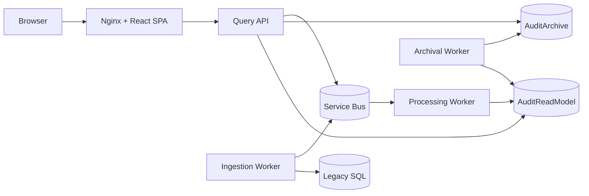

# C4 Container Diagram

| Metadata | Value |
| --- | --- |
| Last updated | 2026-06-21 |
| Owner | Publink Audit architecture |
| Sources | Docker Compose and startup files |
| Confidence | High |
| Related | [Container Diagram](../../architecture/container-diagram.md) |

