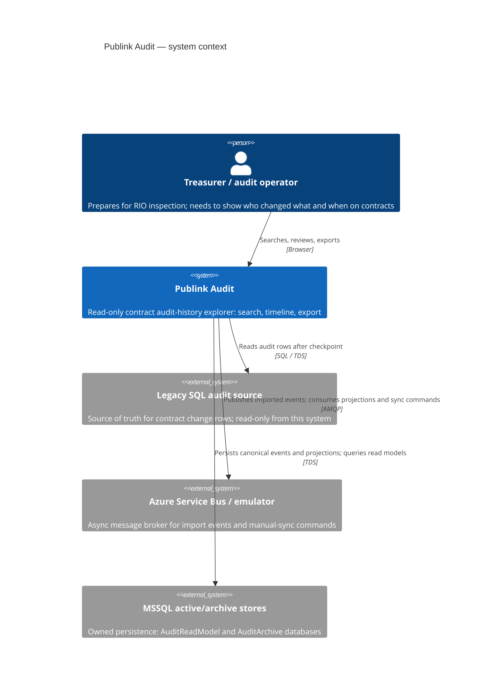

# C4 Context Diagram

| Metadata | Value |
| --- | --- |
| Last updated | 2026-06-23 |
| Owner | Publink Audit architecture |
| Sources | Code/config analysis |
| Confidence | High |
| Related | [Context Diagram](../../architecture/context-diagram.md) |

**MVP boundary.** Inside the boundary: contract-change ingestion from legacy SQL, canonical event storage, search and timeline projections, ZIP export with checksums. Outside the boundary: authentication and authorisation (no identity provider is integrated), writes to the legacy source (it is read-only), legal evidence guarantees (no WORM, signatures or trusted timestamps), and production infrastructure (Docker Compose only). A production deployment must add auth before any real data is served.
