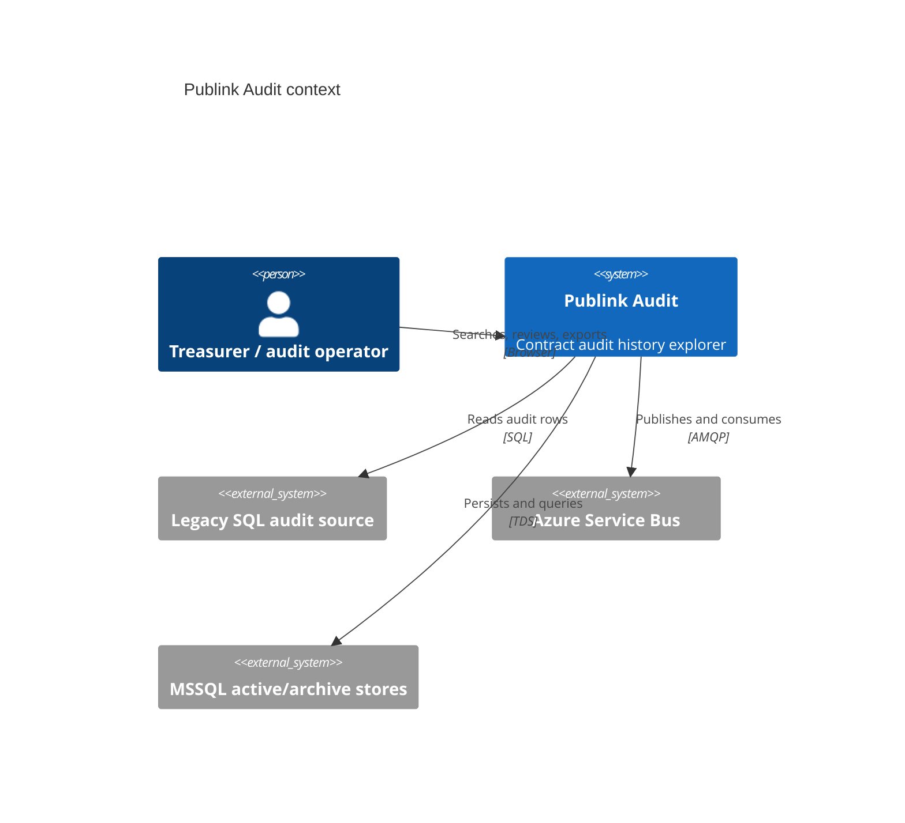

# C4 Context Diagram

| Metadata | Value |
| --- | --- |
| Last updated | 2026-06-21 |
| Owner | Publink Audit architecture |
| Sources | Code/config analysis |
| Confidence | High |
| Related | [Context Diagram](../../architecture/context-diagram.md) |

