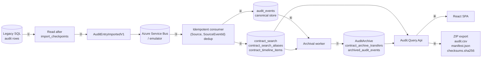

# Audit Data Flow Diagram

| Metadata | Value |
| --- | --- |
| Last updated | 2026-06-23 |
| Owner | Publink Audit architecture |
| Sources | Import, processing, query and archival code |
| Confidence | High |
| Related | [Data Flow](../../architecture/data-flow.md) |

**Legend**

① Ingestion reads legacy audit rows after the last position stored in `import_checkpoints`; this prevents re-importing already processed rows.

② Each legacy row is mapped to an `AuditEntryImportedV1` message and published to the Service Bus `audit-ingestion` endpoint.

③ Processing consumes the event and performs an idempotency check: if `(Source, SourceEventId)` already exists in `audit_events`, the message is completed without any further effect — safe for at-least-once redelivery.

④ A new canonical event row is appended to `audit_events`; this is the immutable record of the imported change.

⑤ Projection tables are updated from the canonical event: `contract_search` holds the current searchable summary, `contract_search_aliases` holds historical searchable values, and `contract_timeline_items` holds timeline rows derived from canonical events.

⑥ The archival worker selects contracts inactive beyond the configured retention period and loads their canonical events, timeline items and aliases.

⑦ The worker writes a replacement snapshot into `AuditArchive`, tracks progress in `contract_archive_transfers`, and on successful serializable recheck deletes active rows (archived events are copied to `archived_audit_events`).

⑧ The Query API reads `contract_search` and `contract_search_aliases` for search, `contract_timeline_items` for timeline pages, and the archive equivalents for archived contracts.

⑨ Export reads the same active/archive models and packages the data as a ZIP with CSV, manifest and SHA-256 checksums for the auditor.
