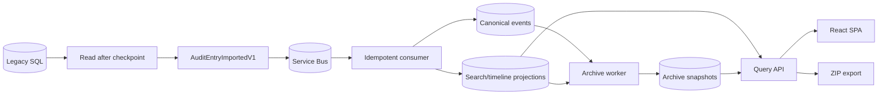

# Audit Data Flow Diagram

| Metadata | Value |
| --- | --- |
| Last updated | 2026-06-21 |
| Owner | Publink Audit architecture |
| Sources | Import, processing, query and archival code |
| Confidence | High |
| Related | [Data Flow](../../architecture/data-flow.md) |

This data-flow view focuses on the owned audit read model. `Canonical events` represents stored imported audit events, while `Search/timeline projections` represents the optimized read tables used by API searches, timelines and exports. The archive worker copies both event history and projection snapshots so archive reads do not depend on hot tables.