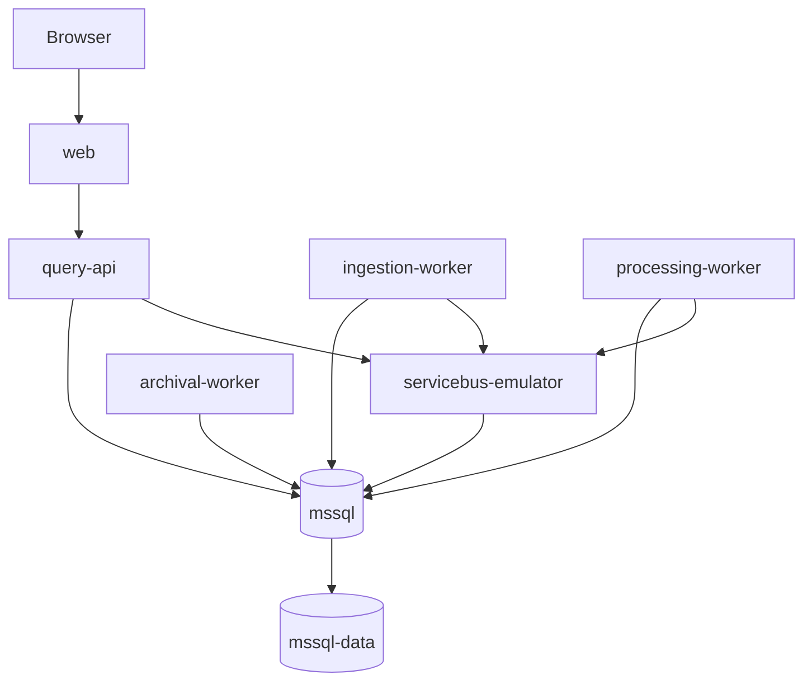

# Docker Compose Deployment Diagram

| Metadata | Value |
| --- | --- |
| Last updated | 2026-06-21 |
| Owner | Publink Audit DevOps |
| Sources | `docker/docker-compose.yml` |
| Confidence | High |
| Related | [Docker](../../infrastructure/docker.md) |

