# Audit Storage ERD

| Metadata | Value |
| --- | --- |
| Last updated | 2026-06-21 |
| Owner | Publink Audit data engineering |
| Sources | `AuditDbContext`, `ArchiveDbContext` |
| Confidence | High |
| Related | [Audit Domain](../../domains/audit-domain.md) |

```mermaid
erDiagram
    audit_events {
        guid EventId PK
        string Source
        long SourceEventId
        long SourceSequence
        guid OrganizationId
        json Payload
    }
    contract_timeline_items {
        guid EventId PK
        guid OrganizationId
        guid ContractId
        long SourceSequence
    }
    contract_search {
        guid OrganizationId PK
        guid ContractId PK
        string ContractNumber
        string ContractorName
        datetime LastActivityAt
    }
    contract_search_aliases {
        guid Id PK
        guid OrganizationId
        guid ContractId
        string Field
        string Value
    }
    import_checkpoints {
        string Source PK
        long LastSourceEventId
    }
    legacy_synchronization_requests {
        string Source PK
        guid CorrelationId UK
    }
    contract_archive_transfers {
        guid OrganizationId PK
        guid ContractId PK
        string State
    }
    archived_contracts {
        guid OrganizationId PK
        guid ContractId PK
    }
    archived_audit_events {
        guid EventId PK
        guid OrganizationId
        guid ContractId
    }
    archived_timeline_items {
        guid EventId PK
        guid OrganizationId
        guid ContractId
    }
    archived_contract_aliases {
        guid OrganizationId PK
        guid ContractId PK
        string Field PK
        string Value PK
    }
    InboxStates {
        guid MessageId PK
        guid ConsumerId PK
        datetime Received
    }
    OutboxMessages {
        guid MessageId PK
        long SequenceNumber PK
        datetime EnqueueTime
    }
    OutboxStates {
        guid OutboxId PK
        long LastSequenceNumber
    }
    audit_events ||--o| contract_timeline_items : EventId
    contract_search ||--o{ contract_search_aliases : contract
    contract_search ||--o{ contract_timeline_items : contract
    audit_events ||--o{ archived_audit_events : archived_copy
    archived_contracts ||--o{ archived_contract_aliases : contract
    archived_contracts ||--o{ archived_timeline_items : contract
```

How to read this ERD:

- `audit_events` stores canonical imported audit events with source identity, sequence and payload data. This is where Publink Audit keeps the original imported event representation used for rebuild/replay analysis, although rebuild tooling is not implemented.
- `contract_search` is the dedicated search projection table for current contract-search fields. `contract_search_aliases` adds historical searchable values so users can find contracts by old numbers, names or other indexed values after changes.
- `contract_timeline_items` is the timeline projection linked to `audit_events` by `EventId`; API timeline reads do not scan raw legacy rows.
- `import_checkpoints` stores the legacy import cursor per source. `legacy_synchronization_requests` stores manual sync lease/state. `contract_archive_transfers` stores archive/reactivation state.
- `archived_*` tables are archive snapshots, including copied event history in `archived_audit_events`.
- `InboxStates`, `OutboxMessages` and `OutboxStates` are MassTransit EF inbox/outbox tables in the active context. They support reliable message consumption/publication and are not audit-domain tables.