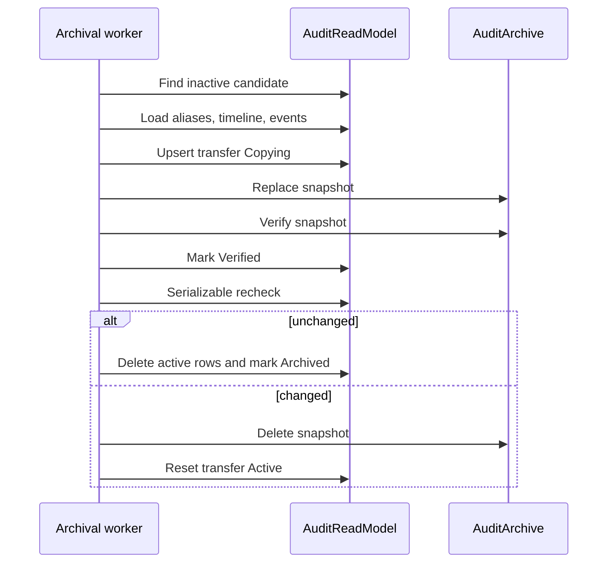

# Archival Sequence

| Metadata | Value |
| --- | --- |
| Last updated | 2026-06-21 |
| Owner | Publink Audit engineering/SRE |
| Sources | Archive lifecycle and executor |
| Confidence | High |
| Related | [Archival State](../state/archival-state.md), [Audit Domain](../../domains/audit-domain.md) |

On exception, lifecycle marks transfer `Failed` with `ErrorCode`, logs and retries on later cycles.