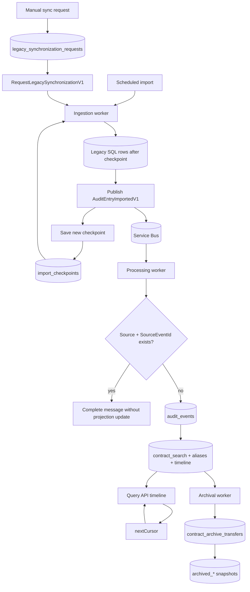

# Checkpoint, Cursor And State Flow

| Metadata | Value |
| --- | --- |
| Last updated | 2026-06-22 |
| Owner | Publink Audit engineering/SRE |
| Sources | Import checkpoint, synchronization request, query cursor and archive transfer code |
| Confidence | High |
| Related | [Import Processing](import-processing.md), [Manual Synchronization](manual-synchronization.md), [Audit Storage ERD](../erd/audit-storage.md), [Archival State](../state/archival-state.md) |

This diagram groups the operational state tables that usually matter during troubleshooting:

- `import_checkpoints` is the legacy import cursor. It controls which source rows the next scheduled or manual import attempts to read.
- `legacy_synchronization_requests` is the manual synchronization lease/state table. It prevents concurrent sync commands from racing for the same source.
- Duplicate handling happens in processing through the existing `(Source, SourceEventId)` event key before updating `contract_search`, `contract_search_aliases` or `contract_timeline_items`.
- API `nextCursor` is a read-pagination cursor, not an import checkpoint. It lets clients continue timeline reads from a stable position.
- `contract_archive_transfers` is the archive/reactivation state ledger. It records copy, verification, archive and recovery progress independently from import checkpoints.