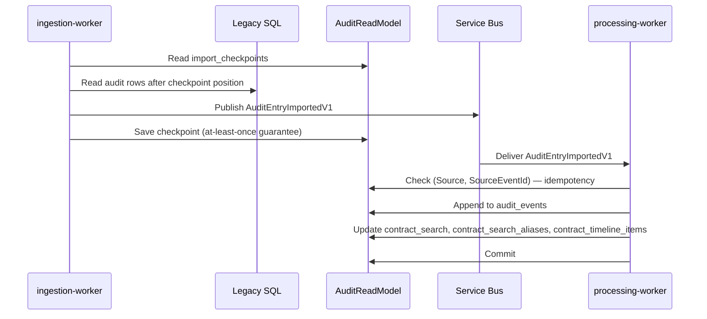
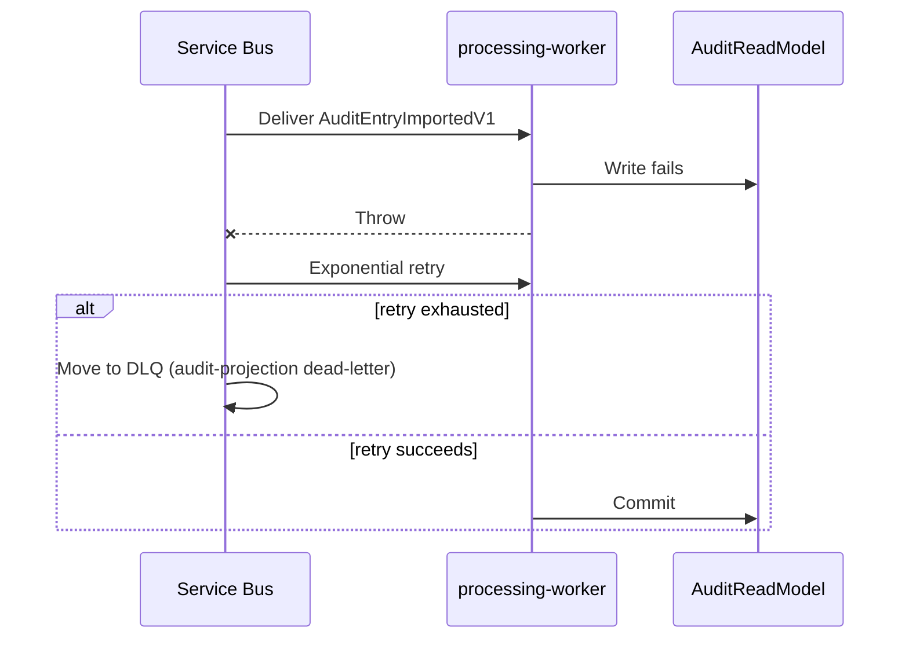
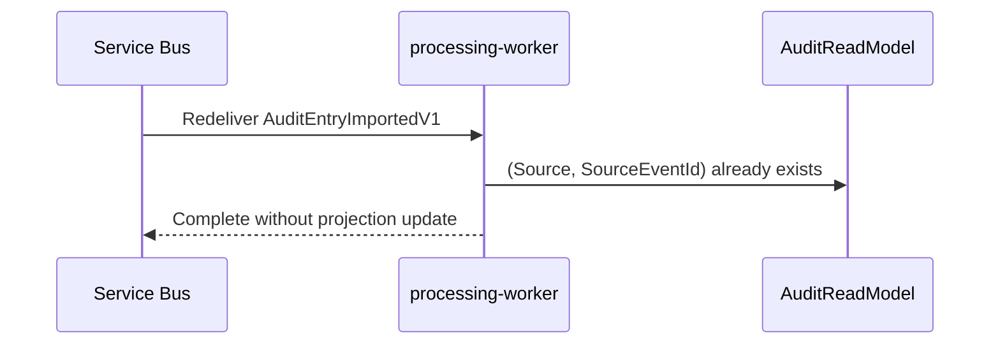

# Import And Processing Sequences

| Metadata | Value |
| --- | --- |
| Last updated | 2026-06-23 |
| Owner | Publink Audit engineering |
| Sources | Legacy importer, mapper, MassTransit config, processing consumer |
| Confidence | High |
| Related | [Data Flow](../../architecture/data-flow.md), [Events](../../api/events.md) |

## Happy Path

The checkpoint is saved *after* publish, not before. This is the at-least-once guarantee: if the worker crashes between publish and checkpoint save, the same rows will be re-published on the next run and the processing consumer's idempotency check (`(Source, SourceEventId)`) will silently discard the duplicate. No audit event is lost; at worst it is delivered twice and deduplicated.

> **Business implication (happy path).** The treasurer's timeline and search data reflect all imported changes. Freshness depends on the polling interval (configurable, default 1 hour) or a manual synchronisation request.

## Failure/Retry

> **Business implication (failure path).** If a message exhausts all retries and moves to the DLQ, the status endpoint (`GET /api/v1/status`) increments its DLQ counter. The operator sees that missing audit data is flagged rather than silently absent, and can investigate without guessing whether the data was ever imported.

## Duplicate

> **Business implication (duplicate path).** Redelivery is safe. The treasurer's timeline and search results are unaffected by duplicate delivery because the second message produces no projection change.
