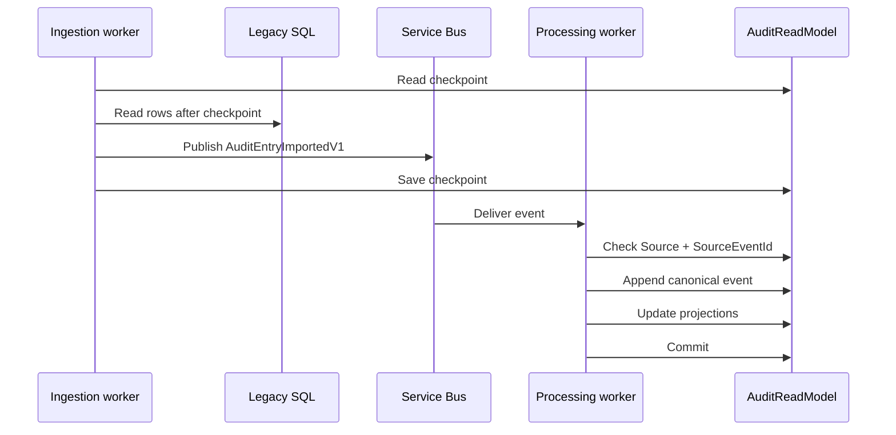
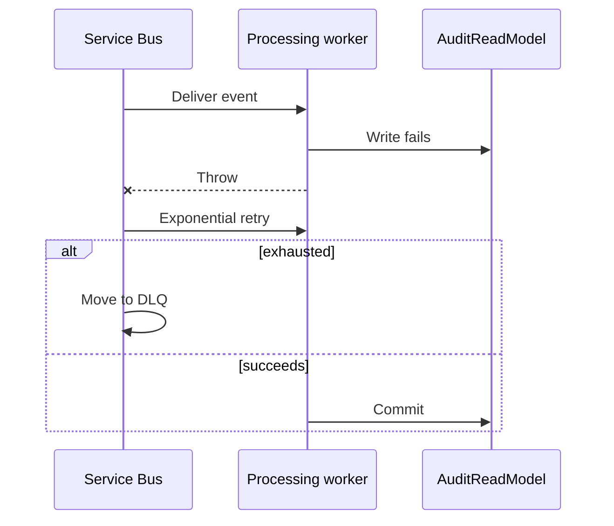
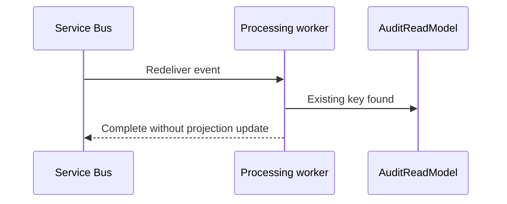

# Import And Processing Sequences

| Metadata | Value |
| --- | --- |
| Last updated | 2026-06-21 |
| Owner | Publink Audit engineering |
| Sources | Legacy importer, mapper, MassTransit config, processing consumer |
| Confidence | High |
| Related | [Data Flow](../../architecture/data-flow.md), [Events](../../api/events.md) |

## Happy Path

The happy path shows two separate safety points: ingestion advances `import_checkpoints` only after publishing imported events, and processing commits canonical event/projection writes only after idempotency checks pass.

## Failure/Retry

This failure path depends on at-least-once messaging. A failed database write causes MassTransit retry/redelivery; when retry is exhausted the message goes to the broker DLQ for operational handling.

## Duplicate

Duplicate handling is based on the unique `(Source, SourceEventId)` business key. Redelivery can happen, but the existing canonical event prevents a second timeline/search projection effect.