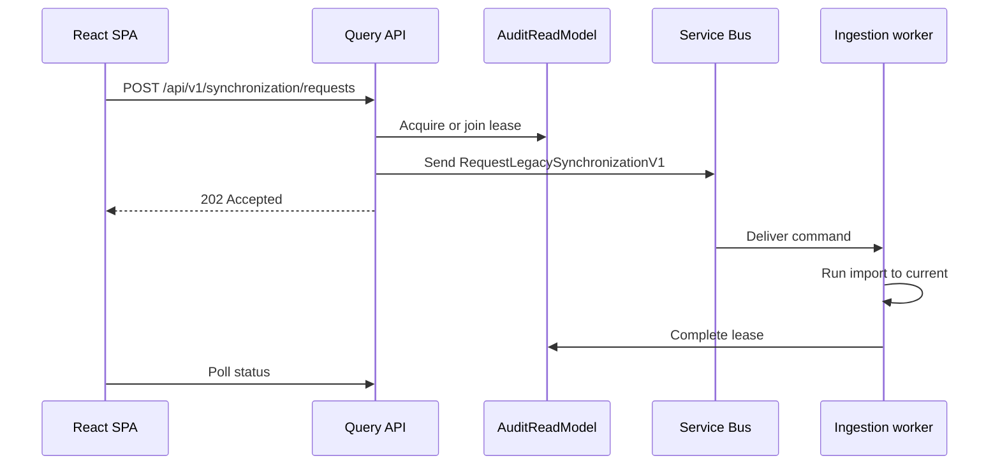

# Manual Synchronization Sequence

| Metadata | Value |
| --- | --- |
| Last updated | 2026-06-21 |
| Owner | Publink Audit engineering |
| Sources | Synchronization endpoints and ingestion consumer |
| Confidence | High |
| Related | [REST API](../../api/rest-api.md), [Runbook](../../getting-started/runbook.md) |

Failure path: if sending the command fails after lease acquisition, Query API releases the lease and returns an error.