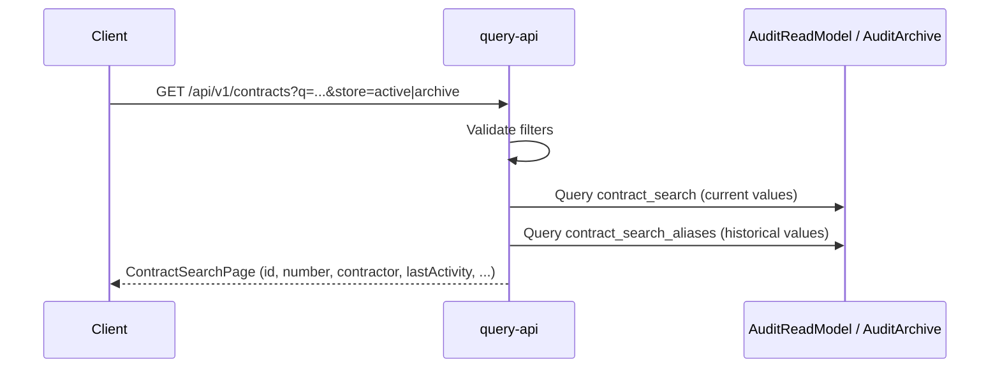
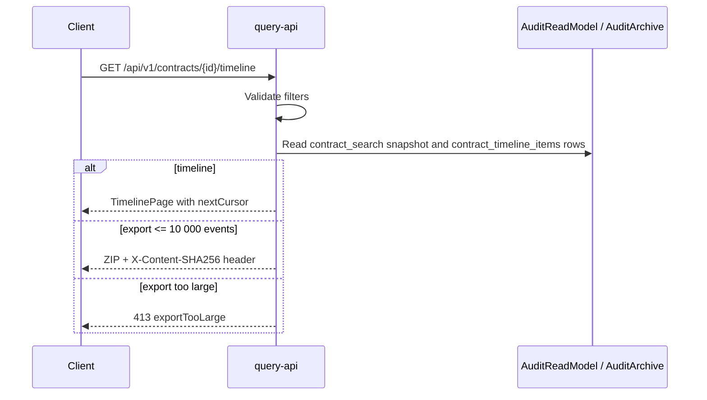

# Query And Export Sequence

| Metadata | Value |
| --- | --- |
| Last updated | 2026-06-23 |
| Owner | Publink Audit API engineering |
| Sources | Query API handlers, Dapper executors, export service |
| Confidence | High |
| Related | [REST API](../../api/rest-api.md), [Error Handling](../../api/error-handling.md) |

## Search Flow

Search by historical values is a key business feature: if a contract's contractor name changed from `ContractorA` to `ContractorB`, both values are stored in `contract_search_aliases` and the contract is findable by either name. This keeps search aligned with how auditors think about contract history, not just the current projection state.

## Timeline And Export Flow

**Export package contents.** The ZIP returned by the export endpoint contains:

- `audit.csv` — all timeline rows in CSV format, one row per change event.
- `manifest.json` — package metadata: contract ID, export timestamp, event count, and file list.
- `checksums.sha256` — SHA-256 hashes for all files in the package.

The checksums allow an auditor to verify that the exported files have not been modified after generation. If a single byte changes in `audit.csv`, the checksum will not match. This is important when the ZIP is handed to an external reviewer, stored in a document management system, or used as evidence in an RIO inspection.

> **Business implication.** The treasurer can export the full audit history of any contract as a self-contained, verifiable package and submit it to auditors without requiring access to the application.
