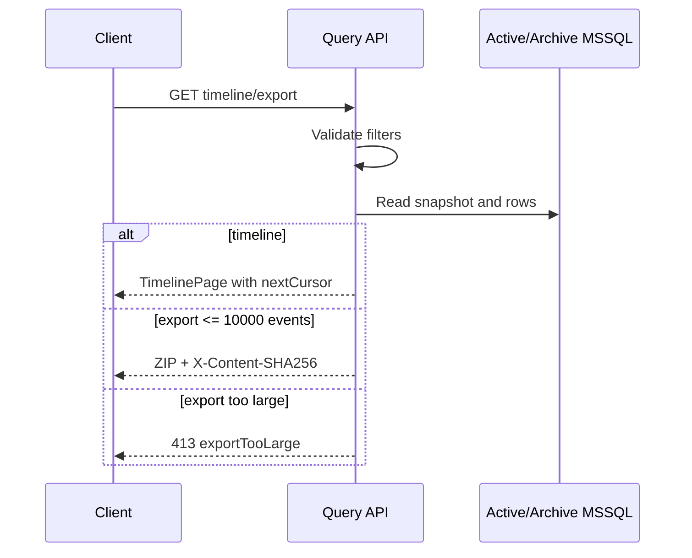

# Query And Export Sequence

| Metadata | Value |
| --- | --- |
| Last updated | 2026-06-21 |
| Owner | Publink Audit API engineering |
| Sources | Query API handlers, Dapper executors, export service |
| Confidence | High |
| Related | [REST API](../../api/rest-api.md), [Error Handling](../../api/error-handling.md) |

