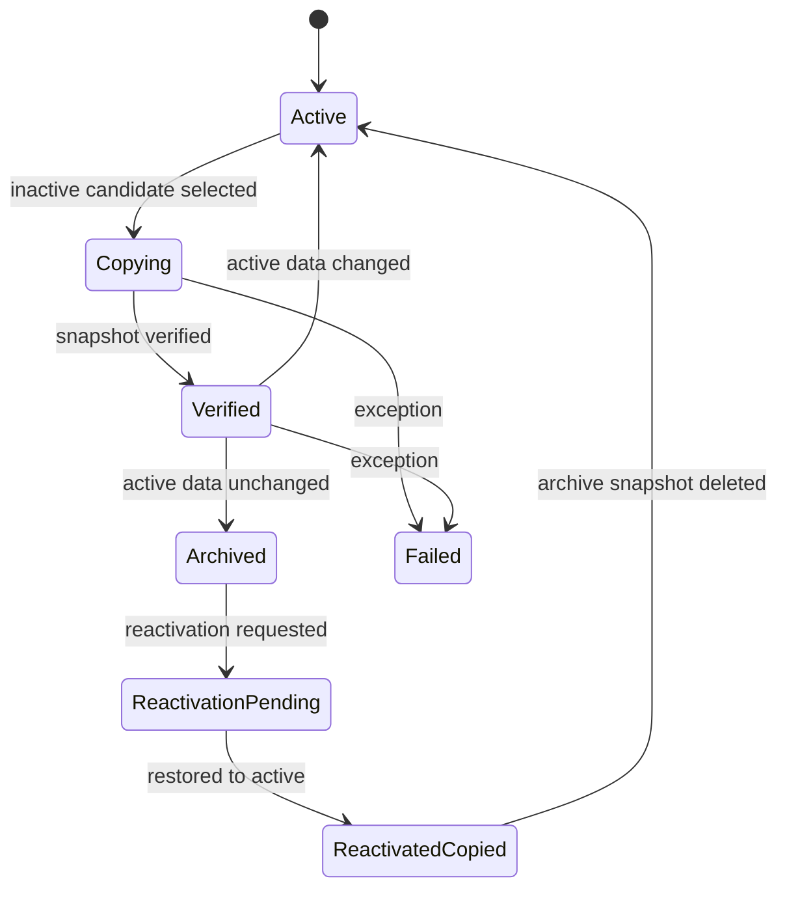

# Archival State Machine

| Metadata | Value |
| --- | --- |
| Last updated | 2026-06-21 |
| Owner | Publink Audit engineering |
| Sources | Archive lifecycle and transfer state usage |
| Confidence | Medium; state names are from reviewed lifecycle code |
| Related | [Archival Sequence](../sequence/archival.md) |

The state machine is backed by `contract_archive_transfers`. It makes archive work resumable: a contract can fail during copy/verification, be retried later, or return to `Active` when the final recheck sees fresh activity before deleting hot rows.