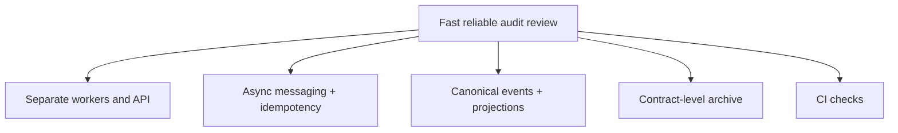

# Presentation Diagrams

| Metadata | Value |
| --- | --- |
| Last updated | 2026-06-21 |
| Owner | Publink Audit architecture / technical writing |
| Sources | Generated diagrams and ADRs |
| Confidence | High |
| Related | [Solution Walkthrough](../solution-walkthrough.md) |

